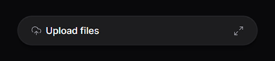
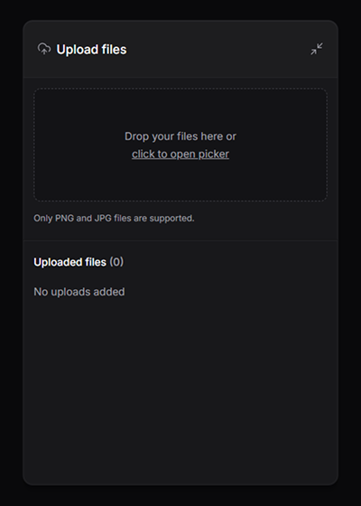
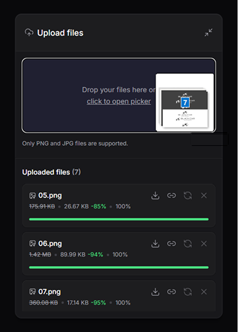
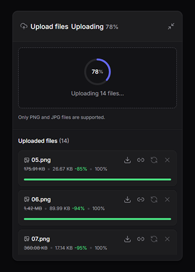
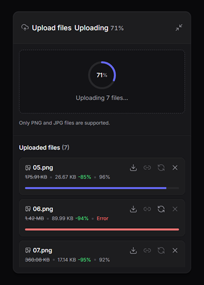
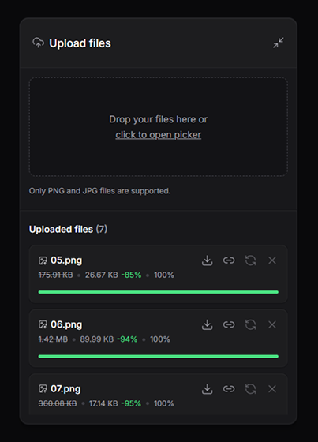

# 🚀 Upload Widget

## 💻 About

A high-performance and modern file upload widget. This project features an intuitive drag-and-drop interface with progress tracking, integration with a Cloudflare R2 backend, and a self-contained demonstration version using the browser's Local Storage.

## ✨ Features

- **Drag-and-Drop Interface:** Easily drag files into the widget to trigger uploads.
- **Client-Side Image Compression & Conversion:** Compresses images and automatically converts PNG/JPG formats to WebP in the browser before sending them to the server to save bandwidth.
- **Progress Tracking:** Real-time upload progress tracking using Axios and Zustand.
- **Backend Integration:** Fastify server with `@fastify/multipart` to stream uploads directly to Cloudflare R2.
- **Demo Mode:** An independent static version (`/demo`) that simulates the backend using `localStorage` for easy demonstration and hosting on GitHub Pages.
- **Auto-Cleanup (Demo):** Automatically removes files older than 5 minutes to prevent local storage overflow.

## 🔖 Layout

Here is a glimpse of the application in action:

<table>
  <tr>
    <td align="center"><strong>Initial view ready</strong></td>
    <td align="center"><strong>Ready for interaction</strong></td>
    <td align="center"><strong>Drag-and-drop</strong></td>
  </tr>
  <tr>
    <td></td>
    <td></td>
    <td></td>
  </tr>
</table>
<table>
  <tr>
    <td align="center"><strong>Uploading Progress</strong></td>
    <td align="center"><strong>Error State</strong></td>
    <td align="center"><strong>Final Success State</strong></td>
  </tr>
  <tr>
    <td></td>
    <td></td>
    <td></td>
  </tr>
</table>

## 🛠 Tech Stack

The project is divided into a frontend (web/demo) and a backend (server).

### Web & Demo

- **[React](https://reactjs.org/)**
- **[Vite](https://vitejs.dev/)**
- **[Tailwind CSS](https://tailwindcss.com/)**
- **[Zustand](https://github.com/pmndrs/zustand)** (State management)
- **[Radix UI](https://www.radix-ui.com/)** (Accessible components)
- **[Lucide React](https://lucide.dev/)** (Icons)

### Server

- **[Node.js](https://nodejs.org/)** (v22)
- **[Fastify](https://fastify.dev/)** (Web framework)
- **[Cloudflare R2](https://developers.cloudflare.com/r2/)** (Storage and upload streaming)
- **[Zod](https://zod.dev/)** (Validation)
- **[TypeScript](https://www.typescriptlang.org/)**

## 🚀 Running Locally

### Prerequisites

Make sure you have Node.js installed. You'll also need a Cloudflare R2 bucket if you intend to run the real backend.

### 1. Setting up the Backend Server

```bash
# Navigate to the server directory
cd server

# Install dependencies
npm install

# Create a .env file and set your Cloudflare R2 credentials
cp .env.example .env
# Edit .env with your Cloudflare R2 credentials

# Start the server (runs on http://localhost:3333)
npm run dev
```

### 2. Setting up the Frontend Web App

```bash
# Open a new terminal and navigate to the web directory
cd web

# Install dependencies
npm install

# Start the frontend
npm run dev
```

_(The frontend will be available at `http://localhost:5173`)_

### 3. Running the Demo Version (No Backend Required)

If you just want to test the interface without configuring a server and an R2 bucket:

```bash
# Navigate to the demo directory
cd demo

# Install dependencies
npm install

# Start the demo version
npm run dev
```

## 📝 License

This project is licensed under the [MIT License](LICENSE).
